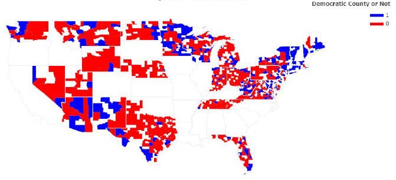
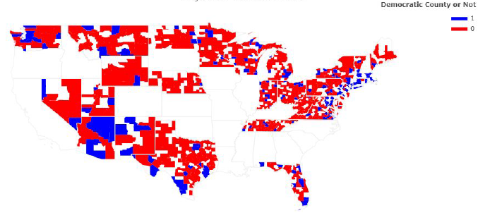

# Data Modelling on US Election Data

This project was done as a course assignment for CS418: Introduction to Data Science course at the University of Illinois at Chicago during the Fall 2019 term along with teammates [Yushenli1996](https://github.com/Yushenli1996) and [nathanhe789](https://github.com/nathanhe789).

----

The dataset was partly provided to us by the Professor. There were 2 CSV files: one contained a [merged data](merged_train.csv) file of demographic data and election data of counties of certain US states from the 2016 US Senate Elections(generated in [this project](https://github.com/samujjwaal/US-Election-Data-Exploration)), and another data file containing only the [demographic data](demographics_test.csv) of some US counties.  

The merged data file was meant to be used for training machine learning classification/predictive models to predict winning political party for a particular county, while the demographic data file was to be used as the testing set for the models.

The merged data file was partitioned into training and validation sets using Holdout method. 75% of data was allocated for training the models and rest 25% for validation of the models.

Additionally, the numeric attributes in the training and validation sets were standardized to have a mean of 0 and variance of 1.

----

The main purpose of the assignment was to perform Data Modelling on the merged demographic-election data. The data modelling tasks performed on the dataset are:

* Build Linear Regression Model
  * Using all attributes
  * By selecting different attributes to find the best set of attributes
  * Using LASSO regression

* Build Classification Models and select 2 best performing models  

  * Using all attributes
  * By selecting different attributes to find the best set of attributes

* Build Clustering Models and select 2 best performing models

  * Using all attributes
  * By selecting different attributes to find the best set of attributes

* Predict the Democratic and Republican party votes of each county using the best performing regression model using the testing set of demographic data

* Predict winning political party in each county using the best performing classification model using the testing set of demographic data

* Create choropleth map to visualize the majority political party of each county as predicted by the best performing classification model

  ----
  
  
Using political party attribute in the dataset

  
  
  
  
Using political party predicted by SVM

  
  

----------

Check out the [Jupyter Notebook](Election_Modelling.ipynb "US Election Data Modelling") or [the project report](Project.pdf "Project Report") to see the data science flow implemented.
